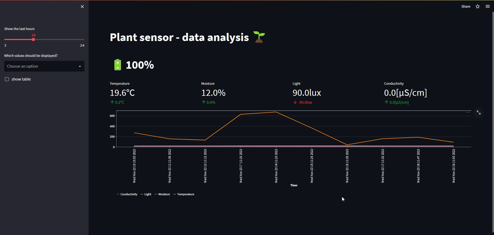

# Plant analysis with Raspberry Pi, Xiaomi MiFlora, Python and the Python-library Streamlit

There were several reasons for this project: On the one hand, I wanted to apply the theoretical Python knowledge practically,
get to know the libraries Pandas and Streamlit and continuously collect data that can be analyzed and processed again later.

