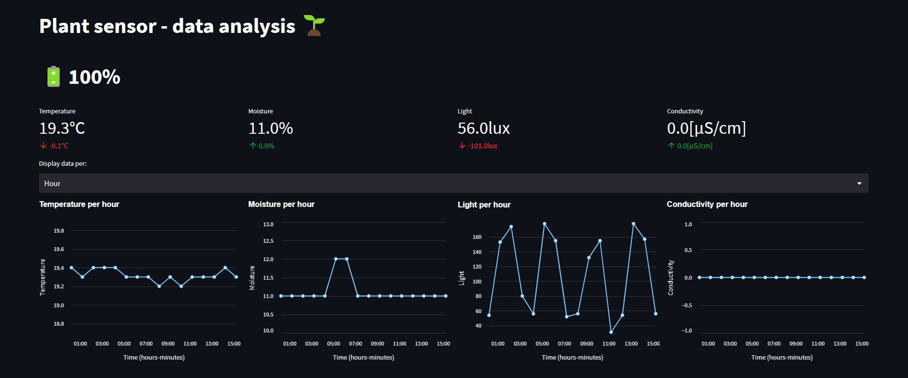

# Plant analysis with Raspberry Pi, Xiaomi MiFlora, Python and the Python-library Streamlit

There were several reasons for this project: On the one hand, I wanted to apply the theoretical Python knowledge practically,
get to know the libraries Pandas and Streamlit and continuously collect data that can be analyzed and processed again later.

## Table of contents
* [General info](#general-info)
* [Technologies](#technologies)

## Technologies
Project is created with:
* Python version : 3.9.15
* Pandas: 1.5.1
* Altair: 4.2.0
* streamlit: 1.15.0
* Raspberry Pi 4
* gsheetdb: 0.1.13.1
